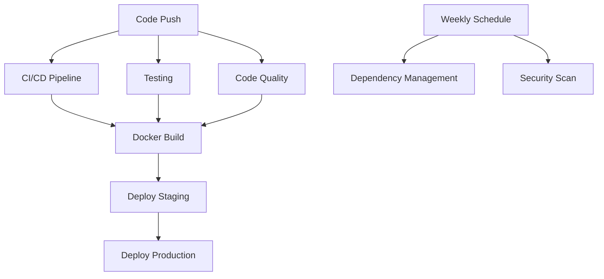

# GitHub Actions Workflows

This document describes all the GitHub Actions workflows implemented for the Host Academy project.

## 🚀 Available Workflows

### 1. CI/CD Pipeline (`ci-cd.yml`)
**Triggers:** Push to main/develop, Pull requests
**Purpose:** Main continuous integration and deployment pipeline

**Jobs:**
- ✅ **Backend Tests** - Tests backend code, runs linting, security audit
- ✅ **Frontend Tests** - Tests frontend code, builds application, bundle analysis
- ✅ **Security Check** - Trivy vulnerability scanning
- ✅ **Docker Build** - Builds and pushes Docker images (main branch only)
- ✅ **Notifications** - Discord notifications for success/failure

### 2. Code Quality & Security (`code-quality.yml`)
**Triggers:** Push to main/develop, Pull requests, Weekly schedule
**Purpose:** Comprehensive code quality and security analysis

**Jobs:**
- 🔍 **Code Quality Analysis** - ESLint, Prettier, SonarCloud
- 🔒 **Security Scan** - Snyk vulnerability scanning
- 📄 **License Check** - License compliance verification
- ⚡ **Lighthouse Audit** - Performance analysis (PR only)
- 🔄 **Dependency Check** - Weekly outdated package check

### 3. Automated Testing (`testing.yml`)
**Triggers:** Push to main/develop, Pull requests
**Purpose:** Comprehensive testing across multiple environments

**Jobs:**
- 🧪 **Unit Tests** - Tests across Node.js 16, 18, 20
- 🔗 **Integration Tests** - API integration testing
- 🌐 **E2E Tests** - Cypress end-to-end testing
- 📊 **Test Summary** - Results summary and PR comments

### 4. Deployment Pipeline (`deployment.yml`)
**Triggers:** Push to main, Version tags, Manual dispatch
**Purpose:** Automated deployment to staging and production

**Jobs:**
- ✅ **Pre-deployment** - Final checks before deployment
- 🐳 **Docker Build** - Build and push to GitHub Container Registry
- 🚀 **Deploy Staging** - Automatic staging deployment
- 🎯 **Deploy Production** - Manual production deployment (requires approval)
- 🔄 **Rollback** - Automatic rollback on failure

### 5. Dependency Management (`dependency-management.yml`)
**Triggers:** Weekly schedule, Manual dispatch
**Purpose:** Automated dependency maintenance and security

**Jobs:**
- 🔍 **Dependency Audit** - Check for outdated packages
- 🔄 **Automated Updates** - Create PRs for minor/patch updates
- 🚨 **Security Check** - Critical vulnerability detection
- 📜 **License Compliance** - License verification
- 📦 **Bundle Analysis** - Frontend bundle size tracking

### 6. Docker Build & Push (`docker.yml`) - Existing
**Triggers:** Push to main
**Purpose:** Legacy Docker build workflow

## 🔧 Required Secrets

Add these secrets to your GitHub repository:

### Docker Hub
- `DOCKERHUB_USERNAME` - Your Docker Hub username
- `DOCKERHUB_TOKEN` - Your Docker Hub access token

### Notifications
- `DISCORD_WEBHOOK` - Discord webhook URL for notifications
- `SLACK_WEBHOOK` - Slack webhook URL for deployment notifications

### Security & Quality Tools
- `SNYK_TOKEN` - Snyk authentication token
- `SONAR_TOKEN` - SonarCloud authentication token
- `CODECOV_TOKEN` - Codecov upload token

## 🌍 Environment Setup

### Repository Environments
Create these environments in your GitHub repository settings:

1. **staging** - For staging deployments
2. **production** - For production deployments (require manual approval)

### Environment Variables
Configure these in your environment settings:
- `API_URL` - Backend API URL for each environment
- `DATABASE_URL` - Database connection string
- `FIREBASE_CONFIG` - Firebase configuration

## 📋 Workflow Status Badges

Add these badges to your main README.md:

```markdown
[](https://github.com/yourusername/Host-Academy/actions/workflows/ci-cd.yml)
[](https://github.com/yourusername/Host-Academy/actions/workflows/code-quality.yml)
[](https://github.com/yourusername/Host-Academy/actions/workflows/testing.yml)
[](https://github.com/yourusername/Host-Academy/actions/workflows/deployment.yml)
```

## 🔄 Workflow Dependencies



## 🚨 Troubleshooting

### Common Issues

1. **Docker Build Fails**
   - Check Dockerfile syntax
   - Ensure all required files are included
   - Verify base image availability

2. **Tests Failing**
   - Check test configuration
   - Ensure all dependencies are installed
   - Verify environment variables

3. **Deployment Fails**
   - Check deployment credentials
   - Verify target environment availability
   - Review deployment scripts

### Debugging Steps

1. Check workflow logs in GitHub Actions tab
2. Review failed job details
3. Check repository secrets configuration
4. Verify branch protection rules
5. Ensure environment variables are set

## 📈 Metrics & Monitoring

The workflows provide several metrics:

- **Build Success Rate** - Track in GitHub Actions
- **Test Coverage** - Uploaded to Codecov
- **Security Score** - Monitored via Snyk/SonarCloud
- **Performance Score** - Tracked via Lighthouse
- **Bundle Size** - Monitored per PR
- **Dependency Health** - Weekly reports

## 🔮 Future Enhancements

Planned improvements:
- [ ] Database migration workflows
- [ ] Multi-environment testing
- [ ] Canary deployments
- [ ] Automated changelog generation
- [ ] Performance regression detection
- [ ] Security baseline scanning
- [ ] Cost optimization monitoring
